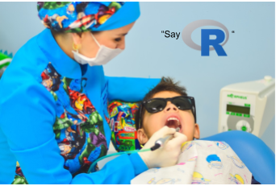

R Taster
========================================================

Robert (Bob) Turner, Katherine (Kittie) Ansboro

June 2019

Plan for the session
========================================================

- Introduction (me talking)
- "Hello world!" example
- Exercise 1 - Charts and T-Tests
- Exercise 2 - Linear Regression

Let's get to know each other...
========================================================

- Who's done some coding? Which languages? Any R?
- Who's used a graphing / plotting / statistics package / spreadsheet? Which ones?
- Who's had formal training in coding? in statistics?

These are really just notes for me!

What the flip is R?
========================================================

- A programming language
- Derived from an older language called "S" (for "statistics", or maybe "Scheme")
- Free and open source
- Around since 1997

Why is R important?
========================================================

Libraries (CRAN):
- Charts
- Statistics
- Machine Learning / AI
- Lots of online examples

But really, why is R actually important?
========================================================

- Big data
- Data science
- Bioinformatics
- Finance

I already hate it, what else can I use?
========================================================

Programming languages
- Python
- Matlab
- Julia
- C++

Statistics Packages
- SPSS
- Minitab
- SAS
- Stata

***

Spreadsheets
- Excel
- Google Sheets

Charting Packages
- Origin
- Prism

Online Tools
- Tableau
- Google Data Studio

What we're doing next...
========================================================

- "Hello world!" example
- Exercise 1 - Charts and T-Tests
- Exercise 2 - Linear Regression

T-Test
========================================================

***

William Sealy Gosset : Total hipster and inventor of the T-Test under the pseudonym "Student".
